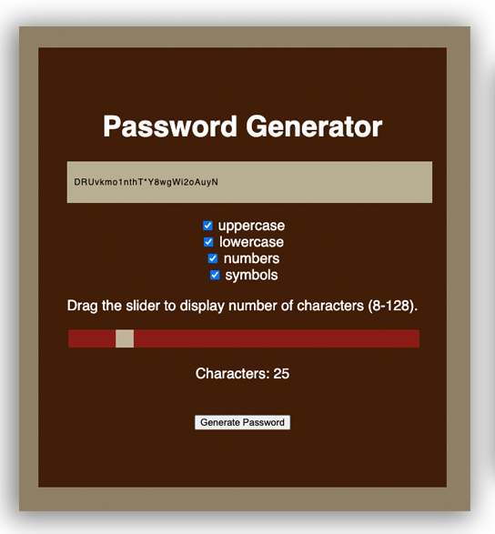

# Random Password Generator

## Description

A program that generates a password with user preferences for length (8-128 characters), upper or lower-case letters and achoices for numbers or special character options.  
______

## Technologies

* Bootstrap

* HTML

* Javascript

* jQuery

* CSS

_________

## Screenshot

_________

## Link

https://bjenkins63.github.io/Random-Password-Generator/